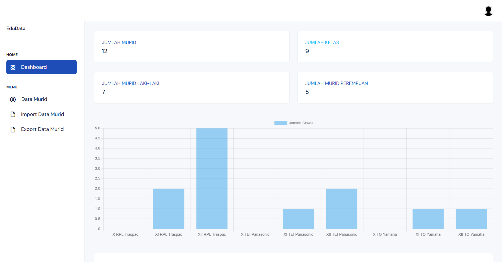

# 📘 Sistem Manajemen Murid

Aplikasi ini adalah sistem manajemen data murid dan kelas berbasis Laravel.
Fitur yang tersedia mencakup dashboard statistik, manajemen murid, autentikasi user digunakan untuk pendataan siswa.

---

## 🚀 Tech Stack

-   HTML, CSS, JavaScript
-   PHP (Laravel)
-   MySQL untuk database
-   Bootstrap untuk styling

---

## 📌 Fitur Utama

-   Tambah Siswa
-   Edit Siswa
-   Hapus Siswa
-   Export Data Siswa (Excel)
-   Import Data Siswa (Excel)
-   Validasi Data Siswa

## 📌 Fitur Lainnya

-   Menampilkan jumlah total murid
-   Menampilkan jumlah total kelas
-   Statistik murid berdasarkan jenis kelamin
-   Grafik jumlah murid per kelas (Chart.js)
-   Daftar murid terbaru dengan pagination

## 🛠 Instalasi

```bash
git clone https://github.com/lyscha/edudata
cd edudata
composer install
npm install
npm run build
cp .env.example .env
php artisan key:generate
php artisan migrate
php artisan db:seed
php artisan serve
```

## Gallery



## Licensi

Proyek ini dirilis di bawah MIT License.
